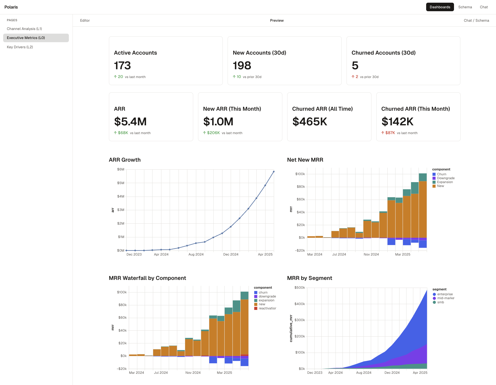
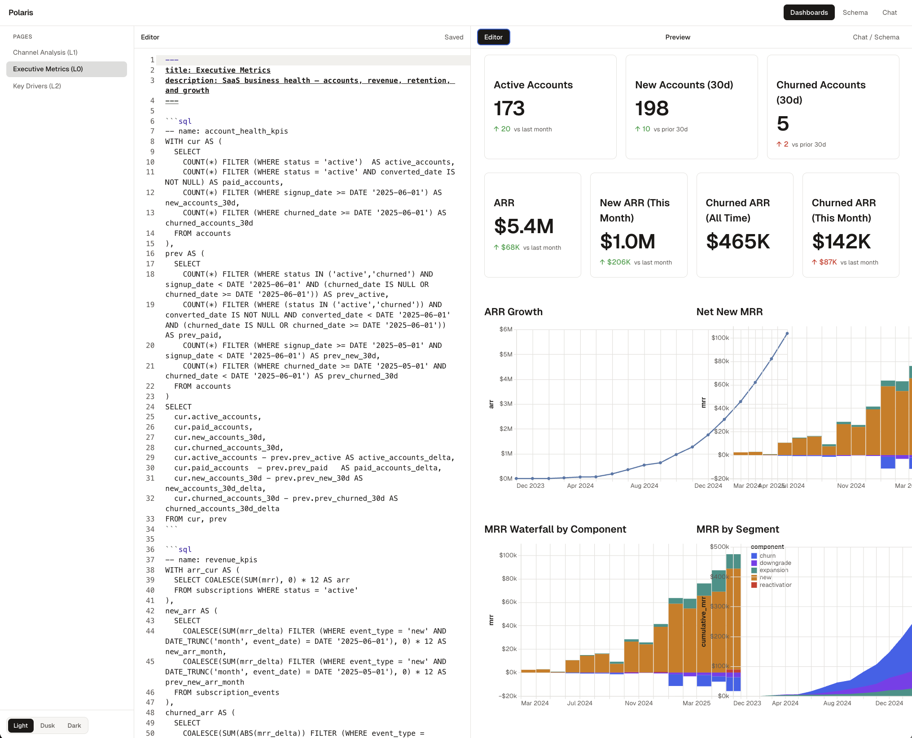
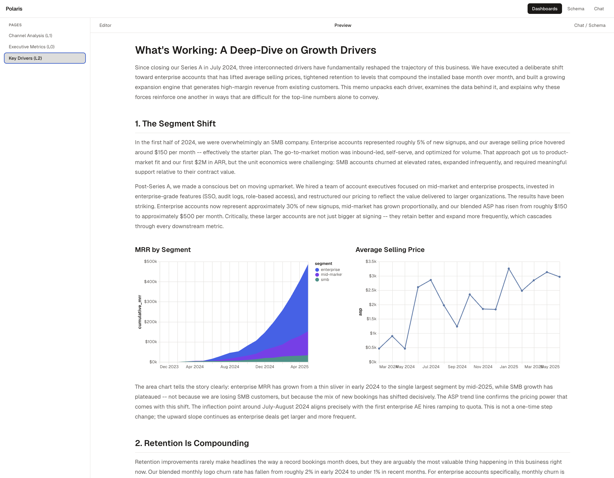

# Polaris

**The open-source BI-as-Code framework built for agents and humans.**

Write SQL, compose charts in Markdown, and ship data apps — from a CLI, an IDE, or an AI agent. Polaris is the visualization layer behind [Northstar](https://findnorthstar.ai), extracted for open-source use.



## Why Polaris

Dashboards shouldn't require a GUI. When an agent analyzes data, it should be able to create a data app as naturally as it writes a report. When a human iterates on a dashboard, they should edit code — not click through menus.

Polaris treats dashboards as **code artifacts**: Markdown files with SQL queries and chart components. This makes them versionable, diffable, composable, and — most importantly — **machine-writable**. An agent can generate a complete Polaris dashboard in a single function call.

**Use cases:**
- Agent workflows that produce visual reports (analysis results, monitoring dashboards, status pages)
- Developer-facing analytics where dashboards live alongside application code
- Data teams that want version-controlled, reviewable dashboards
- Prototyping and exploring data without leaving the terminal

## Quick Start

```bash
npx polaris init my-dashboard --template saas-metrics
cd my-dashboard
npx polaris dev --project .
```

Open [http://localhost:3000](http://localhost:3000).

## How It Works

Drop CSV or Parquet files in `data/`. Write Markdown pages with SQL queries. Polaris auto-registers your data as DuckDB tables and renders interactive charts.

```md
---
title: Revenue Dashboard
---

```sql
-- name: revenue_trend
SELECT DATE_TRUNC('month', order_date) AS month, SUM(amount) AS revenue
FROM orders GROUP BY 1 ORDER BY 1
```

<Grid cols={2}>
  <KPI data="revenue_trend" value="revenue" title="Total Revenue" format="usd_compact" />
  <LineChart data="revenue_trend" x="month" y="revenue" title="Monthly Revenue" yFormat="$~s" xTimeUnit="yearmonth" />
</Grid>
```

No imports — all components are available automatically.

## Live Editor

Edit dashboards in the browser with a side-by-side code editor and live preview. The AI chat panel can modify the current page in context.



## Narrative Dashboards

Go beyond grids of charts. Write long-form analysis with embedded visualizations — the same way you'd write a memo, but with live data.



## Components

### Charts

| Component | Description |
|-----------|-------------|
| `LineChart` | Time series and trends |
| `BarChart` | Comparisons (stacked & grouped) |
| `AreaChart` | Volume over time (stacked) |
| `KPI` | Single-value metric cards with comparison deltas |
| `DataTable` | Searchable, sortable tabular data |
| `Sparkline` | Inline mini charts |

### Filters

| Component | Description |
|-----------|-------------|
| `Dropdown` | Single select |
| `MultiSelect` | Multi-choice select |
| `ButtonGroup` | Toggle button group |
| `TextInput` | Free text input |
| `Slider` | Numeric range |
| `DateInput` | Single date picker |
| `DateRange` | Date range picker |
| `CheckboxFilter` | Checkbox toggle |

### Layout

| Component | Description |
|-----------|-------------|
| `Grid` | N-column responsive grid |
| `Group` | Section with optional title |
| `Tabs` | Tabbed content panels |
| `Divider` | Horizontal separator |

## For Agents

Polaris is designed to be machine-writable. A dashboard is a single Markdown file — an agent generates it, saves it to disk, and it's live.

```python
# Example: agent creates a dashboard after analysis
dashboard_md = agent.generate_dashboard(
    data_path="results.csv",
    title="Q1 Pipeline Analysis",
    metrics=["total_pipeline", "win_rate", "avg_deal_size"]
)

with open("pages/q1-pipeline.md", "w") as f:
    f.write(dashboard_md)
```

The AI chat in the editor also supports iterative refinement — describe what you want changed and the agent updates the page in place.

## CLI

```bash
polaris dev --project .                 # Start dev server
polaris init my-project --template saas-metrics  # Scaffold project
polaris build --project .               # Production build (static site)
polaris preview                         # Preview production build
```

### Templates

| Template | Description |
|----------|-------------|
| `blank` | Empty starter |
| `saas-metrics` | ARR, churn, retention, cohort analysis |
| `sales-pipeline` | Pipeline, forecasting, rep performance |
| `product-analytics` | Engagement, activation, feature usage |

## Architecture

```
Dev Mode                                Production
┌──────────────┐  ┌──────────────┐     ┌──────────────────────┐
│ Browser      │  │ Node.js      │     │ Static Site           │
│              │  │              │     │                      │
│ Edit .md  ───┼──│→ Express API │     │ Pre-rendered queries │
│ Execute SQL ─┼──│→ DuckDB      │     │ DuckDB WASM for      │
│ Render charts│  │  (native)    │     │ filtered queries     │
│ AI chat   ───┼──│→ Claude API  │     │ No server needed     │
└──────────────┘  └──────────────┘     └──────────────────────┘
```

## Tech Stack

- [DuckDB](https://duckdb.org/) — analytical SQL (native in dev, WASM in production)
- [Vega-Lite](https://vega.github.io/vega-lite/) — declarative chart grammar
- [CodeMirror](https://codemirror.net/) — in-browser code editor
- [MDX](https://mdxjs.com/) — Markdown + JSX
- [Vite](https://vitejs.dev/) — build tool
- [React](https://react.dev/) — UI framework

## Northstar

Polaris is the open-source visualization framework extracted from [Northstar](https://findnorthstar.ai), a decision intelligence platform for data teams and AI agents. Northstar uses Polaris for rendering dashboards, data apps, and analytical reports.

If you need a governed metric layer, semantic modeling, decision tracking, or enterprise collaboration — that's [Northstar](https://findnorthstar.ai). If you need to render data as code — that's Polaris.

## Documentation

```bash
npm run docs:build   # Build docs
npm run dev          # Docs served at /docs
```

Full docs at [`docs-site/`](./docs-site).

## License

MIT
